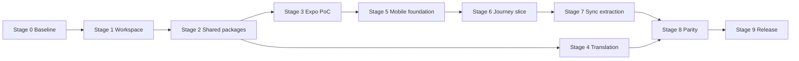
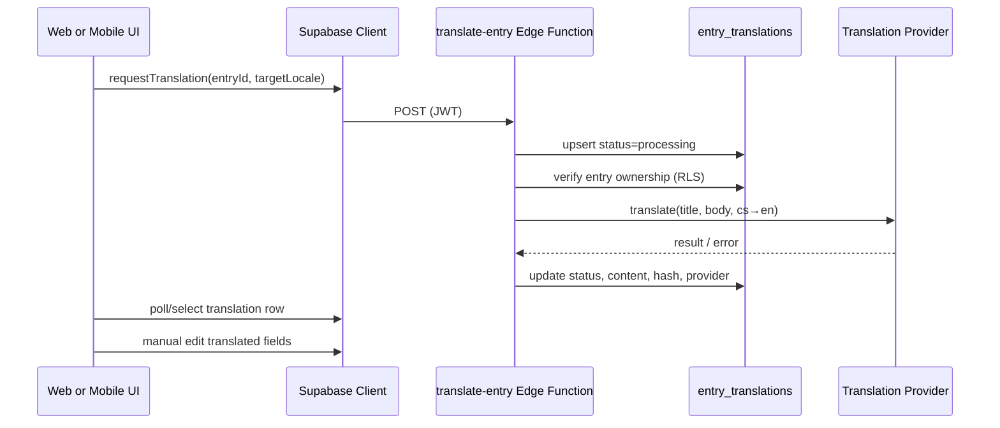

# Expo Mobile Implementation Plan

**Status:** Approved direction — planning only (no production code changes in this document)  
**Last updated:** 2026-07-10  
**Scope:** Introduce Expo React Native mobile app alongside existing React/Vite PWA and Capacitor apps

---

## Document conventions

| Label              | Meaning                                          |
| ------------------ | ------------------------------------------------ |
| **Confirmed**      | Verified by repository inspection                |
| **Recommendation** | Proposed approach based on evidence              |
| **Assumption**     | Reasonable but unverified; requires spike or PoC |
| **PoC gate**       | Must be validated in Stage 3 before proceeding   |

---

## 1. Updated architecture diagram

```mermaid
flowchart TB
  subgraph clients [Client applications]
    WEB["Web PWA<br/>React + Vite + Tailwind<br/>TanStack Router + Dexie<br/>MapLibre GL JS"]
    CAP["Capacitor iOS/Android<br/>WebView wrapper<br/>production during migration"]
    MOB["Expo Mobile<br/>React Native + Expo Router<br/>expo-sqlite + MapLibre RN"]
  end

  subgraph shared [Shared packages - incremental extraction]
    CORE["@trip-diary/core<br/>domain models + Zod schemas"]
    API["@trip-diary/api<br/>Supabase client factory + remote repos"]
    I18N["@trip-diary/i18n<br/>translation resources"]
    UTILS["@trip-diary/utils<br/>pure helpers"]
    CONFIG["@trip-diary/config<br/>env schemas"]
    MAPS["@trip-diary/maps<br/>provider registry + style resolver"]
    TRANS["@trip-diary/translation<br/>types + contracts"]
    SYNC["@trip-diary/sync<br/>rules + engine - Stage 7+"]
    STORAGE["@trip-diary/storage<br/>ports - Stage 7+"]
  end

  subgraph platform [Platform adapters - per app]
    WEB_DEXIE["Dexie adapter"]
    WEB_MAP["MapLibre GL JS renderer"]
    WEB_PWA["Workbox PWA"]
    MOB_SQLITE["expo-sqlite adapter"]
    MOB_MAP["@maplibre/maplibre-react-native"]
    MOB_MEDIA["expo-image-picker / expo-file-system"]
  end

  subgraph backend [Supabase backend - unchanged authority]
    DB[(PostgreSQL + RLS)]
    EDGE["Edge Functions<br/>nature-gbif, og-share, translate-entry"]
    STORAGE_BUCKET["Storage buckets"]
  end

  WEB --> CORE & API & I18N & UTILS & CONFIG & MAPS & TRANS
  CAP --> WEB
  MOB --> CORE & API & I18N & UTILS & CONFIG & MAPS & TRANS & SYNC & STORAGE

  WEB --> WEB_DEXIE & WEB_MAP & WEB_PWA
  MOB --> MOB_SQLITE & MOB_MAP & MOB_MEDIA

  API --> DB
  EDGE --> DB
  WEB_DEXIE --> DB
  MOB_SQLITE --> DB
```



**Confirmed data flow today** (`docs/architecture.md`):

```text
UI → application services → repositories → IndexedDB / Supabase
```

**Target flow after migration:**

```text
UI (web or native) → app services → shared repositories → StoragePort / Supabase
```

---

## 2. Repository structure — initial migration phase

Web application **stays at repository root** (confirmed: single `package.json`, `src/`, `capacitor.config.ts`, `ios/`, `android/`).

```text
trip-diary/
├── package.json                 # web app package (existing root package)
├── pnpm-workspace.yaml          # extended with workspace packages
├── pnpm-lock.yaml
├── src/                         # web source — UNMOVED in early stages
├── apps/
│   └── mobile/                  # new Expo application
│       ├── app/                 # Expo Router routes
│       ├── src/
│       │   ├── features/        # native UI only
│       │   └── platform/        # SQLite, maps, media adapters
│       ├── app.json / app.config.ts
│       └── package.json
├── packages/
│   ├── core/                    # entity models, Zod schemas, pure lib
│   ├── api/                     # Supabase types, remote repository contracts
│   ├── i18n/                    # en.ts, cs.ts resources
│   ├── utils/                   # slug, journey-content, map-points, bbox
│   ├── config/                  # env Zod schemas (platform-neutral)
│   ├── maps/                    # map provider registry + style resolver
│   ├── translation/             # translation domain types + client API
│   ├── storage/                 # Stage 7+: StoragePort interfaces
│   └── sync/                    # Stage 7+: sync rules (not full 1671-line dump initially)
├── supabase/                    # migrations, functions, tests
├── ios/, android/               # Capacitor — retained until Stage 9
├── capacitor.config.ts
├── vite.config.ts
├── dist/                        # Capacitor webDir (unchanged)
└── docs/
    ├── expo-mobile-implementation-plan.md   # this document
    └── migration-status.md                  # Stage 0 artifact
```

### Workspace configuration (Recommendation)

```yaml
# pnpm-workspace.yaml (extended)
packages:
  - .
  - apps/*
  - packages/*

allowBuilds:
  sharp: true
  unrs-resolver: true
```

Root `.` remains the web package. **Confirmed:** current `pnpm-workspace.yaml` only has `allowBuilds` — no `packages` array yet.

### Import strategy during migration

| Phase     | Web imports                                    | Mobile imports                   |
| --------- | ---------------------------------------------- | -------------------------------- |
| Stage 1–2 | `@/*` alias unchanged; gradual `@trip-diary/*` | `@trip-diary/*` only             |
| Stage 7+  | Both `@/*` (app-specific) and `@trip-diary/*`  | `@trip-diary/*` + local platform |

**Non-goal (early stages):** Moving `src/` to `apps/web/src/`.

---

## 3. Stage-by-stage plan

### Stage 0 — Baseline and repository safety

| Item                       | Detail                                                   |
| -------------------------- | -------------------------------------------------------- |
| **Goal**                   | Establish verified baseline; no architectural change     |
| **Scope**                  | Documentation and verification only                      |
| **Agent ownership**        | Documentation and release agent                          |
| **Dependencies**           | None                                                     |
| **Files likely to change** | `docs/migration-status.md` (new)                         |
| **Database changes**       | None                                                     |
| **Tests**                  | Run existing suite; record results                       |
| **CI/CD changes**          | None                                                     |
| **Manual verification**    | `pnpm check`, `pnpm native:doctor`, Capacitor sync smoke |
| **Rollback**               | Delete new doc                                           |
| **Definition of done**     | Baseline recorded; main branch behavior unchanged        |
| **Non-goals**              | Any package extraction, Expo scaffold, schema changes    |

**Confirmed verification commands** (`package.json`, `README.md`):

```bash
pnpm check          # format:check + lint + typecheck + test + build
pnpm db:lint        # requires supabase start
pnpm db:test        # pgTAP RLS tests
pnpm test:e2e       # Playwright (CI runs subset)
pnpm native:sync    # Capacitor build path
```

**CI today (Confirmed):** `.github/workflows/ci.yml` runs `pnpm check`, database-security (`db:lint`, `db:test`, `db:types` diff check), and E2E subset on every PR/push to `main`.

---

### Stage 1 — Minimal workspace preparation

| Item                       | Detail                                                                                                                                                                                       |
| -------------------------- | -------------------------------------------------------------------------------------------------------------------------------------------------------------------------------------------- |
| **Goal**                   | Introduce pnpm workspace without moving web app or breaking Capacitor/CI                                                                                                                     |
| **Scope**                  | `pnpm-workspace.yaml`, root scripts, empty `apps/mobile` placeholder, workspace TypeScript references                                                                                        |
| **Agent ownership**        | Workspace and tooling agent                                                                                                                                                                  |
| **Dependencies**           | Stage 0 complete                                                                                                                                                                             |
| **Files likely to change** | `pnpm-workspace.yaml`, root `package.json` (workspace scripts only), `apps/mobile/package.json` (minimal stub), `tsconfig.json` (references), `.github/workflows/ci.yml` (path filters prep) |
| **Database changes**       | None                                                                                                                                                                                         |
| **Tests**                  | All Stage 0 tests still pass                                                                                                                                                                 |
| **CI/CD**                  | Add path-filter scaffolding; default job unchanged                                                                                                                                           |
| **Manual verification**    | `pnpm install`, `pnpm check`, `pnpm native:sync`                                                                                                                                             |
| **Rollback**               | Revert workspace yaml; remove `apps/mobile`                                                                                                                                                  |
| **Definition of done**     | Workspace installs; web builds; Capacitor sync works; no mobile code required yet                                                                                                            |
| **Non-goals**              | Moving web source; extracting packages; Expo native build                                                                                                                                    |

---

### Stage 2 — Extract low-risk shared packages

| Item                       | Detail                                                                                                                                      |
| -------------------------- | ------------------------------------------------------------------------------------------------------------------------------------------- |
| **Goal**                   | Share platform-independent domain code without touching Dexie or sync engine                                                                |
| **Scope**                  | `packages/core`, `packages/i18n`, `packages/config`, `packages/utils`, `packages/maps` (registry only), `packages/translation` (types only) |
| **Agent ownership**        | Shared-domain extraction agent; maps agent (registry subset)                                                                                |
| **Dependencies**           | Stage 1 complete                                                                                                                            |
| **Files likely to change** | New `packages/*`; web files updated to re-export or import from packages; `tsconfig` project references                                     |
| **Database changes**       | None                                                                                                                                        |
| **Tests**                  | Move/adapt existing unit tests for extracted modules (e.g. `map-style.test.ts`, `slug.test.ts`, `entry.test.ts`)                            |
| **CI/CD**                  | Add `packages/**` to shared trigger paths                                                                                                   |
| **Manual verification**    | `pnpm check`; spot-check web dev server                                                                                                     |
| **Rollback**               | Revert package extraction PRs one at a time                                                                                                 |
| **Definition of done**     | Web uses shared packages for extracted modules; zero Dexie/sync changes                                                                     |
| **Non-goals**              | `packages/api` remote repos (optional small start); storage; sync; Expo feature code                                                        |

**Confirmed extraction candidates (platform-independent):**

- `src/entities/*/model/*.ts` → `packages/core`
- `src/shared/i18n/en.ts`, `cs.ts` → `packages/i18n`
- `src/shared/config/env.ts` → `packages/config` (abstract `import.meta.env` behind injectable `readPublicEnv()`)
- `src/shared/lib/slug.ts`, `src/features/journeys/lib/journey-content.ts`, `journey-map-points.ts`, `journey-bbox.ts` → `packages/utils`
- Map provider registry (new, informed by `src/shared/lib/map-style.ts`) → `packages/maps`

**Explicitly excluded from Stage 2:**

- `src/shared/lib/local-db.ts` and all `local-*.repository.ts`
- `src/shared/sync/sync.service.ts` (1,671 lines — **Confirmed**)
- `src/entities/photo/lib/photo-selection.ts`, `process-photo.ts` (platform-coupled)

---

### Stage 3 — Expo vertical proof of concept

| Item                       | Detail                                                                                           |
| -------------------------- | ------------------------------------------------------------------------------------------------ |
| **Goal**                   | Validate highest-risk technical assumptions before large extraction                              |
| **Scope**                  | Functional Expo dev build with end-to-end slice                                                  |
| **Agent ownership**        | Expo scaffold agent; Supabase/auth agent; SQLite agent (minimal); native photo agent; maps agent |
| **Dependencies**           | Stage 1–2 complete (types, config, maps registry available)                                      |
| **Files likely to change** | `apps/mobile/**`, `packages/maps/**`, `packages/api` (minimal Supabase client), root CI workflow |
| **Database changes**       | None                                                                                             |
| **Tests**                  | Mobile unit tests for env/maps resolver; manual device smoke checklist                           |
| **CI/CD**                  | Add `mobile-quality` job (typecheck + expo config validate); no full native cloud build yet      |
| **Manual verification**    | See §13 PoC acceptance criteria                                                                  |
| **Rollback**               | `apps/mobile` can remain behind feature flag; web unaffected                                     |
| **Definition of done**     | All PoC acceptance criteria met or blockers documented with decision                             |
| **Non-goals**              | Feature parity; shared sync extraction; translation UI                                           |

**PoC must validate (Assumption → PoC gate):**

1. Expo development build (not only Expo Go if plugins required)
2. Supabase auth with AsyncStorage session persistence
3. Load one existing journey from Supabase
4. Expo Router basic stack navigation
5. expo-sqlite: cache journey JSON; offline read after airplane mode
6. `@maplibre/maplibre-react-native` renders map
7. Mapy.com **tourist** map as default provider (**Note:** current web uses `outdoor` tiles — see §10)
8. Fallback to OSM when Mapy key missing
9. `expo-image-picker` or camera: select/capture photo
10. EXIF/metadata extraction (`exifr` or native alternative)
11. Local file persistence (`expo-file-system`)
12. Deferred upload to Supabase Storage when back online
13. `expo-location` current position
14. One minimal queued offline mutation (e.g. local draft flag or sync_operations row in SQLite)

---

### Stage 4 — Automatic Czech-to-English translation

| Item                       | Detail                                                                                                                                                      |
| -------------------------- | ----------------------------------------------------------------------------------------------------------------------------------------------------------- |
| **Goal**                   | Backend translation capability usable from web now and mobile later                                                                                         |
| **Scope**                  | DB migration, Edge Function, shared contracts, web review/edit UI                                                                                           |
| **Agent ownership**        | Translation backend agent; translation UI agent; shared-domain agent (types)                                                                                |
| **Dependencies**           | Stage 2 `packages/core` + `packages/translation` types stable. **Can run parallel with Stage 3** after Stage 2 merges                                       |
| **Files likely to change** | `supabase/migrations/*`, `supabase/functions/translate-entry/`, `packages/translation/`, `src/features/entries/`, `src/entities/entry/`, `src/shared/i18n/` |
| **Database changes**       | Yes — `entry_translations` table (see §12)                                                                                                                  |
| **Tests**                  | pgTAP RLS tests; Edge Function auth/idempotency tests; web UI states                                                                                        |
| **CI/CD**                  | Deploy `translate-entry` in `pages.yml` / `supabase.yml`; add function tests                                                                                |
| **Manual verification**    | Full user flow §4.1                                                                                                                                         |
| **Rollback**               | Migration reversible; feature flag `TRANSLATION_ENABLED` in Edge Function                                                                                   |
| **Definition of done**     | Web user can complete §4.1 flow; API ready for mobile client                                                                                                |
| **Non-goals**              | Native article editor; multi-target language UI beyond EN; inline auto-translate on every keystroke                                                         |

#### §4.1 First-version user flow

1. Create or edit entry (article) in Czech (`language: 'cs'`)
2. Request English translation
3. See progress (pending → processing → succeeded/failed)
4. Review and manually edit English title/body
5. Retry failed translation
6. Regenerate translation (new provider call, new hash check)
7. Warning when Czech source changed after translation (`stale` status)

---

### Stage 5 — Mobile application foundation

| Item                       | Detail                                                                                 |
| -------------------------- | -------------------------------------------------------------------------------------- |
| **Goal**                   | Production-quality shell for incremental feature delivery                              |
| **Scope**                  | Auth lifecycle, navigation shell, theme, SQLite migrations, query client, env, logging |
| **Agent ownership**        | Expo scaffold agent; SQLite agent; Supabase agent; testing agent                       |
| **Dependencies**           | Stage 3 PoC passed                                                                     |
| **Files likely to change** | `apps/mobile/**`, `packages/api`, `packages/config`                                    |
| **Database changes**       | None (Supabase); local SQLite schema v1 in mobile only                                 |
| **Tests**                  | Auth persistence test; SQLite migration test; navigation smoke                         |
| **CI/CD**                  | Mobile job on `apps/mobile/**` or `packages/**` changes                                |
| **Manual verification**    | Sign in/out; cold start session restore; offline banner                                |
| **Rollback**               | Mobile app not released; web unaffected                                                |
| **Definition of done**     | Stable authenticated shell with profile + space selection                              |
| **Non-goals**              | Journey editing parity; push notifications; sync extraction                            |

---

### Stage 6 — Native journey and memory vertical slice

| Item                       | Detail                                                                                                      |
| -------------------------- | ----------------------------------------------------------------------------------------------------------- |
| **Goal**                   | First production-valuable native feature slice                                                              |
| **Scope**                  | Journey list/detail, native map, offline memory create, photo+GPS, sync status display                      |
| **Agent ownership**        | Expo agent; photo agent; maps agent; SQLite agent (feature tables)                                          |
| **Dependencies**           | Stage 5 complete; PoC patterns reused                                                                       |
| **Files likely to change** | `apps/mobile/src/features/journeys/**`, `apps/mobile/src/features/photos/**`, `apps/mobile/src/platform/**` |
| **Database changes**       | None (Supabase); SQLite schema extensions for journeys/photos locally                                       |
| **Tests**                  | Contract tests for local journey cache; photo metadata parsing; map marker model                            |
| **CI/CD**                  | Add Android prebuild validation on `main` and mobile-release tags                                           |
| **Manual verification**    | Device checklist: create memory offline → sync on reconnect                                                 |
| **Rollback**               | Feature-flag route in mobile                                                                                |
| **Definition of done**     | Journey detail with map + offline memory creation works on device                                           |
| **Non-goals**              | Full checklist/nature/engagement; shared sync engine extraction                                             |

---

### Stage 7 — Storage and synchronization extraction

| Item                       | Detail                                                                                                                       |
| -------------------------- | ---------------------------------------------------------------------------------------------------------------------------- |
| **Goal**                   | Share offline/sync logic between web (Dexie) and mobile (SQLite)                                                             |
| **Scope**                  | Incremental extraction — **not** big-bang rewrite of `sync.service.ts`                                                       |
| **Agent ownership**        | Synchronization agent; SQLite agent; architecture integrator                                                                 |
| **Dependencies**           | Stage 3 PoC validated StoragePort + SyncQueue contracts; Stage 6 mobile slice provides real usage                            |
| **Files likely to change** | `packages/storage/`, `packages/sync/`, `src/shared/sync/`, `src/shared/lib/local-db.ts`, `apps/mobile/src/platform/storage/` |
| **Database changes**       | None                                                                                                                         |
| **Tests**                  | Shared behavioral contract tests (§8); existing `sync.service.test.ts` must pass                                             |
| **CI/CD**                  | Contract test job for both adapters                                                                                          |
| **Manual verification**    | Web offline flows unchanged; mobile sync matches web semantics                                                               |
| **Rollback**               | Keep adapters side-by-side; web continues using Dexie direct path until cutover per module                                   |
| **Definition of done**     | Sync queue operations behave identically on Dexie and SQLite adapters for contract test suite                                |
| **Non-goals**              | One generic ORM; rewriting all 30+ local repos in one PR                                                                     |

**Extraction order (Recommendation):**

1. `SyncOperation` store + `sync-operation.ts` schema
2. `entries` local store
3. `photos` + variants store
4. Upload executor port
5. Remaining entity stores (journeys, checklist, nature…)
6. Sync orchestration rules extracted function-by-function from `sync.service.ts`

---

### Stage 8 — Feature parity and production hardening

| Item                       | Detail                                                                                  |
| -------------------------- | --------------------------------------------------------------------------------------- |
| **Goal**                   | Remaining mobile features + release readiness                                           |
| **Scope**                  | Nature, checklist, sharing, settings, push notifications, deep links, a11y, performance |
| **Agent ownership**        | Feature agents per domain; testing agent; documentation agent                           |
| **Dependencies**           | Stage 6–7 substantial progress                                                          |
| **Files likely to change** | `apps/mobile/**`, shared packages as needed                                             |
| **Database changes**       | Only if feature gaps require schema updates                                             |
| **Tests**                  | Targeted mobile interaction tests; one offline E2E scenario                             |
| **CI/CD**                  | iOS prebuild on release branches; nightly mobile build                                  |
| **Manual verification**    | Full `docs/native-testing.md` equivalent for Expo                                       |
| **Rollback**               | Per-feature flags                                                                       |
| **Definition of done**     | Expo app passes release checklist (§9.1)                                                |
| **Non-goals**              | Capacitor removal; web PWA changes beyond shared packages                               |

---

### Stage 9 — Expo release and Capacitor deprecation

| Item                       | Detail                                                                      |
| -------------------------- | --------------------------------------------------------------------------- |
| **Goal**                   | Ship Expo to stores; retire Capacitor after validated parity                |
| **Scope**                  | Store config, rollout, deprecation                                          |
| **Agent ownership**        | Documentation and release agent; integrator sign-off                        |
| **Dependencies**           | Stage 8 complete; production soak period                                    |
| **Files likely to change** | `apps/mobile` release config; remove Capacitor deps/scripts/docs when ready |
| **Database changes**       | None expected                                                               |
| **Tests**                  | Full regression; store TestFlight/Internal testing                          |
| **CI/CD**                  | Release workflow; signed builds                                             |
| **Manual verification**    | Store submission checklist                                                  |
| **Rollback**               | Keep Capacitor builds available until Expo stable ≥ 2 release cycles        |
| **Definition of done**     | Expo in production; Capacitor deprecated with documented rollback           |
| **Non-goals**              | Forcing users to migrate instantly; removing web PWA                        |

---

## 4. Agent responsibility matrix

### Coordinating integrator (1 agent, always active across stages)

| Field                  | Detail                                                                                                |
| ---------------------- | ----------------------------------------------------------------------------------------------------- |
| **Responsibility**     | Cross-package contracts, merge conflict resolution, full `pnpm check`, prevent duplicate abstractions |
| **May modify**         | `packages/*/package.json`, shared interfaces, `docs/migration-status.md`, CI path filters             |
| **Must avoid**         | Feature UI in web/mobile without coordination; direct `sync.service.ts` refactors in parallel         |
| **Inputs**             | PR plans from stage agents                                                                            |
| **Outputs**            | Approved contract changes; merge order decisions                                                      |
| **Tests owned**        | Final gate: full web `pnpm check` before any stage marked complete                                    |
| **Definition of done** | Stage checklist signed off                                                                            |

---

### Architecture and dependency agent

| Field               | Detail                                                                                       |
| ------------------- | -------------------------------------------------------------------------------------------- |
| **Responsibility**  | Package boundaries, dependency graph, interface definitions                                  |
| **May modify**      | `packages/*/src/index.ts`, `docs/expo-mobile-implementation-plan.md`, `docs/architecture.md` |
| **Must avoid**      | Implementation in `apps/mobile`, `src/features/**/ui`                                        |
| **Parallel**        | Yes, with documentation agent in Stage 0                                                     |
| **Merge conflicts** | Low                                                                                          |
| **Tests**           | Dependency boundary lint rules (optional)                                                    |
| **Done**            | Contract ADRs merged before dependent agents start                                           |

---

### Workspace and tooling agent

| Field               | Detail                                                                                                    |
| ------------------- | --------------------------------------------------------------------------------------------------------- |
| **Responsibility**  | pnpm workspace, TS project references, root scripts, path aliases                                         |
| **May modify**      | `pnpm-workspace.yaml`, root `package.json`, `tsconfig*.json`, `.github/workflows/ci.yml` (structure only) |
| **Must avoid**      | `src/shared/sync/sync.service.ts`, entity business logic                                                  |
| **Dependencies**    | Architecture agent Stage 1 design                                                                         |
| **Parallel**        | **No** with other root config editors                                                                     |
| **Merge conflicts** | **High** — sole owner of root toolchain per stage                                                         |
| **Tests**           | `pnpm install`, `pnpm check`                                                                              |
| **Done**            | Workspace installs cleanly; web unchanged                                                                 |

---

### Expo scaffold agent

| Field               | Detail                                                              |
| ------------------- | ------------------------------------------------------------------- |
| **Responsibility**  | `apps/mobile` creation, Expo Router, app.config, EAS/dev build      |
| **May modify**      | `apps/mobile/**`                                                    |
| **Must avoid**      | Root `src/`, `packages/sync`, `sync.service.ts`, Capacitor projects |
| **Dependencies**    | Workspace agent Stage 1                                             |
| **Parallel**        | Yes with translation backend after Stage 2                          |
| **Merge conflicts** | Low in `apps/mobile`                                                |
| **Tests**           | Expo config validation; TypeScript                                  |
| **Done**            | Dev build launches; navigation skeleton works                       |

---

### Shared-domain extraction agent

| Field               | Detail                                                                                                                                            |
| ------------------- | ------------------------------------------------------------------------------------------------------------------------------------------------- |
| **Responsibility**  | Move pure TS to `packages/core`, `utils`, `i18n`, `config`                                                                                        |
| **May modify**      | `packages/core/**`, `packages/utils/**`, `packages/i18n/**`, `packages/config/**`, web import paths in `src/entities/**/model`, `src/shared/i18n` |
| **Must avoid**      | `local-db.ts`, `sync.service.ts`, `apps/mobile` (until imports stable)                                                                            |
| **Dependencies**    | Workspace agent                                                                                                                                   |
| **Parallel**        | Yes with maps registry agent                                                                                                                      |
| **Merge conflicts** | Medium on web import paths                                                                                                                        |
| **Tests**           | Moved unit tests pass                                                                                                                             |
| **Done**            | Web consumes packages; no runtime change                                                                                                          |

---

### Supabase and authentication agent

| Field              | Detail                                                                                             |
| ------------------ | -------------------------------------------------------------------------------------------------- |
| **Responsibility** | `packages/api` client factory, auth adapters, session persistence                                  |
| **May modify**     | `packages/api/**`, `apps/mobile/src/platform/auth/**`, `src/shared/api/supabase.ts` (thin wrapper) |
| **Must avoid**     | RLS migrations (translation agent owns); sync engine                                               |
| **Dependencies**   | `packages/config`                                                                                  |
| **Parallel**       | Yes in Stage 3+                                                                                    |
| **Tests**          | Auth persistence; `getSupabaseClient` factory                                                      |
| **Done**           | Web and mobile share client factory interface                                                      |

---

### SQLite and offline-storage agent

| Field              | Detail                                                                 |
| ------------------ | ---------------------------------------------------------------------- |
| **Responsibility** | expo-sqlite schema, migrations, StoragePort implementations            |
| **May modify**     | `apps/mobile/src/platform/storage/**`, `packages/storage/**`           |
| **Must avoid**     | `sync.service.ts` until Stage 7; web `local-db.ts` until adapter ready |
| **Dependencies**   | PoC Stage 3 contracts                                                  |
| **Parallel**       | Limited — conflicts with sync agent on `packages/storage`              |
| **Tests**          | SQLite migration tests; contract tests                                 |
| **Done**           | Contract tests pass for assigned stores                                |

---

### Synchronization agent

| Field               | Detail                                                                    |
| ------------------- | ------------------------------------------------------------------------- |
| **Responsibility**  | Incremental `packages/sync` extraction; Dexie adapter                     |
| **May modify**      | `packages/sync/**`, `src/shared/sync/**` (gradual), `packages/storage/**` |
| **Must avoid**      | `apps/mobile` UI; **must not** rewrite entire 1,671-line file in one PR   |
| **Dependencies**    | Stage 3 PoC + Stage 7 entry; SQLite agent StoragePort                     |
| **Parallel**        | **No** with other sync/storage editors                                    |
| **Merge conflicts** | **High**                                                                  |
| **Tests**           | `sync.service.test.ts`, `*.offline.test.ts`, contract tests               |
| **Done**            | Each extracted module has tests; web behavior identical                   |

---

### Native photo and file agent

| Field              | Detail                                                                    |
| ------------------ | ------------------------------------------------------------------------- |
| **Responsibility** | Image pick/capture, EXIF, local files, upload queue                       |
| **May modify**     | `apps/mobile/src/platform/media/**`, `apps/mobile/src/features/photos/**` |
| **Must avoid**     | Web `photo-selection.ts` unless fixing shared types; Capacitor plugins    |
| **Dependencies**   | Expo scaffold; `packages/core` photo types                                |
| **Parallel**       | Yes in Stage 3/6                                                          |
| **Tests**          | Metadata parsing unit tests; upload integration mock                      |
| **Done**           | Photo pick → local save → deferred upload works on device                 |

---

### Maps agent

| Field              | Detail                                                                                                                                                                 |
| ------------------ | ---------------------------------------------------------------------------------------------------------------------------------------------------------------------- |
| **Responsibility** | `packages/maps` registry, web adapter, mobile MapLibre RN integration                                                                                                  |
| **May modify**     | `packages/maps/**`, `src/shared/lib/map-style.ts` (thin wrapper), `apps/mobile/src/platform/maps/**`, `src/features/journeys/ui/JourneyMap.tsx` (inject resolver only) |
| **Must avoid**     | Hard-coding tile URLs in UI components                                                                                                                                 |
| **Dependencies**   | `packages/config` for env                                                                                                                                              |
| **Parallel**       | Yes in Stage 2–3                                                                                                                                                       |
| **Tests**          | Provider selection, fallback, invalid config (§10)                                                                                                                     |
| **Done**           | Web and mobile use same registry; no URL literals in UI                                                                                                                |

---

### Translation backend agent

| Field              | Detail                                                                                       |
| ------------------ | -------------------------------------------------------------------------------------------- |
| **Responsibility** | Migration, RLS, Edge Function, provider adapter, cost controls                               |
| **May modify**     | `supabase/migrations/**`, `supabase/functions/translate-entry/**`, `packages/translation/**` |
| **Must avoid**     | Web/mobile UI; `sync.service.ts`                                                             |
| **Dependencies**   | Stage 2 `packages/core` entry types                                                          |
| **Parallel**       | Yes with Expo PoC after Stage 2                                                              |
| **Tests**          | pgTAP RLS; function auth; idempotency; mock provider                                         |
| **Done**           | Edge Function deployed; migration applied                                                    |

---

### Translation UI agent

| Field              | Detail                                                                                               |
| ------------------ | ---------------------------------------------------------------------------------------------------- |
| **Responsibility** | Web translation request/review/edit/stale states                                                     |
| **May modify**     | `src/features/entries/**`, `src/pages/entry/**`, `src/shared/i18n/**`, `packages/translation` client |
| **Must avoid**     | Edge Function secrets in client; mobile UI until Stage 8                                             |
| **Dependencies**   | Translation backend agent API stable                                                                 |
| **Parallel**       | After backend PR merges                                                                              |
| **Tests**          | UI state machine tests; entry editor integration                                                     |
| **Done**           | §4.1 user flow complete on web                                                                       |

---

### Testing and CI agent

| Field              | Detail                                                                           |
| ------------------ | -------------------------------------------------------------------------------- |
| **Responsibility** | CI matrix, path filters, contract test harness, flaky test triage                |
| **May modify**     | `.github/workflows/**`, `packages/*/vitest.config.ts`, `apps/mobile` test config |
| **Must avoid**     | Removing coverage without documentation                                          |
| **Dependencies**   | Workspace agent                                                                  |
| **Parallel**       | Yes; reviews others' test additions                                              |
| **Tests**          | CI itself                                                                        |
| **Done**           | PR checks reliable; path filters correct                                         |

---

### Documentation and release agent

| Field              | Detail                                                                 |
| ------------------ | ---------------------------------------------------------------------- |
| **Responsibility** | `docs/migration-status.md`, release checklists, native-testing updates |
| **May modify**     | `docs/**`, `README.md` (minimal)                                       |
| **Must avoid**     | Production logic                                                       |
| **Parallel**       | Always                                                                 |
| **Done**           | Docs match shipped stage                                               |

---

## 5. Dependency graph



**Critical path:** S0 → S1 → S2 → S3 → S5 → S6 → S7 → S8 → S9

**Parallel safe after S2:**

- S3 (Expo PoC) ‖ S4 (Translation backend + web UI)
- Maps registry (part of S2) ‖ Translation types
- Documentation updates ‖ any stage

**Must be sequential:**

- S1 before any `packages/*` (workspace required)
- S2 before S3/S4 (shared types)
- S3 before S7 (PoC contracts)
- S7 before claiming sync parity
- S8 before S9

---

## 6. Parallelization plan

| Stream                    | Start after        | Parallel with                 | Conflict risk        |
| ------------------------- | ------------------ | ----------------------------- | -------------------- |
| Workspace tooling         | S0                 | None (sole root config owner) | —                    |
| Shared package extraction | S1                 | Maps registry                 | Medium (web imports) |
| Expo PoC                  | S2                 | Translation backend           | Low (disjoint paths) |
| Translation DB + Edge Fn  | S2                 | Expo PoC                      | Low                  |
| Translation web UI        | S4 backend merge   | Mobile PoC                    | Low                  |
| Mobile foundation         | S3 pass            | Translation UI                | Low                  |
| Sync extraction           | S3 pass + S6 slice | None with sync agent          | High                 |

**Rule:** Only **one agent** may modify root `package.json`, `pnpm-workspace.yaml`, `tsconfig.json`, or `sync.service.ts` at a time.

---

## 7. Pull request breakdown

### PR conventions

- Small, reviewable (target < 500 LOC changed except extraction moves)
- Each PR leaves `main` green with `pnpm check`
- Shared package changes trigger full web validation
- Mobile PRs add `cd apps/mobile && pnpm typecheck` minimum

### Recommended PR sequence (first 15)

| PR     | Stage | Purpose                                | Owner          | Deps           | Tests                |
| ------ | ----- | -------------------------------------- | -------------- | -------------- | -------------------- |
| PR-001 | 0     | Migration status doc + baseline log    | Docs           | —              | Manual `pnpm check`  |
| PR-002 | 1     | pnpm workspace + empty mobile stub     | Workspace      | PR-001         | `pnpm check`         |
| PR-003 | 2     | `packages/config` + env injector       | Shared-domain  | PR-002         | env schema tests     |
| PR-004 | 2     | `packages/core` entry + journey models | Shared-domain  | PR-003         | existing model tests |
| PR-005 | 2     | `packages/i18n`                        | Shared-domain  | PR-002         | smoke import         |
| PR-006 | 2     | `packages/maps` registry + resolver    | Maps           | PR-003         | map provider tests   |
| PR-007 | 2     | Web thin wrapper for map-style         | Maps           | PR-006         | `map-style.test.ts`  |
| PR-008 | 3     | Expo app scaffold + Router             | Expo           | PR-002         | mobile typecheck     |
| PR-009 | 3     | Supabase auth in mobile                | Supabase       | PR-008         | auth persistence     |
| PR-010 | 3     | SQLite minimal cache + offline read    | SQLite         | PR-009         | sqlite test          |
| PR-011 | 3     | MapLibre RN + provider wiring          | Maps           | PR-006, PR-008 | map render smoke     |
| PR-012 | 3     | Photo pick + metadata + upload         | Photo          | PR-009         | metadata tests       |
| PR-013 | 3     | PoC: one offline mutation queue        | SQLite         | PR-010         | queue contract test  |
| PR-014 | 4     | Translation DB migration + RLS         | Translation BE | PR-004         | `pnpm db:test`       |
| PR-015 | 4     | `translate-entry` Edge Function        | Translation BE | PR-014         | function tests       |

### First three PRs (recommended start)

#### PR-001 — Baseline and migration status

| Field            | Detail                                                                                              |
| ---------------- | --------------------------------------------------------------------------------------------------- |
| **Purpose**      | Record verified baseline; create tracking doc                                                       |
| **Files**        | `docs/migration-status.md` (new), optional `docs/expo-mobile-implementation-plan.md` link in README |
| **Owner**        | Documentation and release agent                                                                     |
| **Dependencies** | None                                                                                                |
| **Tests**        | Run and record: `pnpm check`, `pnpm db:test` (if local Supabase available)                          |
| **Merge order**  | First                                                                                               |
| **Rollback**     | Delete docs                                                                                         |
| **DoD**          | Baseline metrics recorded; no code behavior change                                                  |

#### PR-002 — Minimal pnpm workspace

| Field            | Detail                                                                                                                                                      |
| ---------------- | ----------------------------------------------------------------------------------------------------------------------------------------------------------- |
| **Purpose**      | Add workspace packages array; stub `apps/mobile`; workspace install                                                                                         |
| **Files**        | `pnpm-workspace.yaml`, `apps/mobile/package.json`, `apps/mobile/.gitkeep` or minimal `app.json`, root `package.json` (name/workspace fields only if needed) |
| **Owner**        | Workspace and tooling agent                                                                                                                                 |
| **Dependencies** | PR-001                                                                                                                                                      |
| **Tests**        | `pnpm install --frozen-lockfile`, `pnpm check`, `pnpm native:sync`                                                                                          |
| **Merge order**  | Second                                                                                                                                                      |
| **Rollback**     | Revert workspace yaml; remove `apps/mobile`                                                                                                                 |
| **DoD**          | CI green; Capacitor sync works; lockfile committed                                                                                                          |

#### PR-003 — Extract `packages/config`

| Field            | Detail                                                                                                           |
| ---------------- | ---------------------------------------------------------------------------------------------------------------- |
| **Purpose**      | Platform-neutral env schema + injector; web uses adapter                                                         |
| **Files**        | `packages/config/**`, `src/shared/config/env.ts` → thin re-export, `packages/config/package.json`, TS references |
| **Owner**        | Shared-domain extraction agent                                                                                   |
| **Dependencies** | PR-002                                                                                                           |
| **Tests**        | Port `env.ts` validation tests; `pnpm check`                                                                     |
| **Merge order**  | Third                                                                                                            |
| **Rollback**     | Revert package; restore inline env                                                                               |
| **DoD**          | Web build identical; `VITE_*` still resolved                                                                     |

---

## 8. Test strategy

### By layer

| Layer                                         | Test type                                    | Location                                     | When required                 |
| --------------------------------------------- | -------------------------------------------- | -------------------------------------------- | ----------------------------- |
| Pure functions (schemas, utils, map resolver) | Unit (Vitest)                                | `packages/*`                                 | Every PR touching package     |
| Storage adapters                              | Behavioral contract tests                    | `packages/storage/tests/`                    | Stage 7+                      |
| Supabase Edge Functions                       | HTTP + auth integration                      | `supabase/functions/*/test` or `tests/edge/` | Translation PRs               |
| Translation provider                          | Mocked adapter + optional live smoke         | `packages/translation`                       | Stage 4                       |
| Web UI translation states                     | RTL component tests                          | `src/features/entries/`                      | Stage 4                       |
| Expo screens                                  | Minimal interaction tests                    | `apps/mobile`                                | Stage 5–6 critical flows only |
| Native integrations                           | Device smoke checklist                       | `docs/mobile-smoke-checklist.md`             | Stage 3+ manual               |
| Offline workflow                              | One Playwright E2E (web) + one mobile manual | `tests/e2e/`                                 | Stage 7                       |

### Shared contract tests (Stage 7)

Execute same suite against `DexieAdapter` and `SQLiteAdapter`:

1. Enqueue and retrieve sync operation by id
2. Preserve FIFO ordering for pending operations
3. Mark operation failed → pending retry
4. Save and load offline entry by id
5. Mark entity deleted (tombstone)
6. Recover interrupted upload state (photo pending → syncing)

**Do not** assert identical SQL/IndexedDB queries — test **behavioral outcomes** only.

### Tests requiring adjustment when workspace lands (Confirmed paths)

| File                               | Reason                                                                  |
| ---------------------------------- | ----------------------------------------------------------------------- |
| `src/shared/lib/map-style.test.ts` | May move to `packages/maps`; update import paths                        |
| `src/**/*.test.ts` using `@/`      | Remain valid if web stays at root                                       |
| `.github/workflows/ci.yml`         | Add mobile job paths; `database.types.ts` path unchanged until moved    |
| `pnpm db:types` output path        | Stays `src/shared/api/database.types.ts` until explicit move (Stage 7+) |

### Coverage philosophy

- Prefer **few high-value tests** over broad shallow E2E
- Testing agent may replace brittle tests if documented (see user rules)
- No large new E2E suite in initial migration

---

## 9. CI/CD change plan

### Current state (Confirmed)

| Workflow       | Trigger          | Jobs                                                           |
| -------------- | ---------------- | -------------------------------------------------------------- |
| `ci.yml`       | PR + push `main` | `quality` (`pnpm check`), `database-security`, `e2e` (2 specs) |
| `pages.yml`    | push `main`      | Supabase migrate + deploy web to GitHub Pages                  |
| `supabase.yml` | manual           | migrate + deploy edge functions                                |

### Proposed CI matrix

#### Every PR (path-filtered)

| Job                 | Paths trigger                                                                            | Command                                             |
| ------------------- | ---------------------------------------------------------------------------------------- | --------------------------------------------------- |
| `web-quality`       | `src/**`, `packages/**`, `package.json`, `pnpm-lock.yaml`, `vite.config.ts`, `tsconfig*` | `pnpm check`                                        |
| `database-security` | `supabase/**`, `src/shared/api/database.types.ts`                                        | `pnpm db:lint`, `pnpm db:test`, `db:types` diff     |
| `packages-test`     | `packages/**`                                                                            | `pnpm --filter "./packages/*" test`                 |
| `mobile-quality`    | `apps/mobile/**`, `packages/**`                                                          | `pnpm --filter mobile typecheck`, `npx expo-doctor` |
| `e2e`               | `src/**`, `tests/e2e/**`                                                                 | existing Playwright subset                          |

**Critical:** `packages/**` changes run **both** `web-quality` and `mobile-quality`.

#### Main branch only

| Job                | Command                                                               |
| ------------------ | --------------------------------------------------------------------- |
| `android-prebuild` | `cd apps/mobile && npx expo prebuild --platform android --no-install` |
| All PR jobs        | —                                                                     |

#### Nightly / pre-release

| Job                      | Command                                       |
| ------------------------ | --------------------------------------------- |
| `ios-prebuild`           | expo prebuild iOS (if macOS runner available) |
| `mobile-bundle-size`     | optional                                      |
| `translation-live-smoke` | optional mocked→live provider test            |

#### Not on every PR

- Full iOS/Android EAS cloud build (cost/time) — **release tags only**
- Full Playwright suite (run nightly or pre-release)
- Capacitor native compile (unchanged: local/manual until Expo replaces)

### Preserving current release processes

| Release               | Until      | CI impact                                                      |
| --------------------- | ---------- | -------------------------------------------------------------- |
| Web GitHub Pages      | Indefinite | `pages.yml` unchanged; `pnpm build` at root                    |
| Capacitor iOS/Android | Stage 9    | `pnpm native:sync` stays at root; `ios/`, `android/` untouched |
| Supabase migrations   | Indefinite | Add `translate-entry` deploy step when Stage 4 ships           |

---

## 10. Map provider and fallback plan

### Current state (Confirmed)

- `src/shared/lib/map-style.ts` uses **Mapy.com outdoor** tiles (`/maptiles/outdoor/tiles.json`), not tourist
- Fallback when `VITE_MAPY_API_KEY` missing: OpenStreetMap raster tiles
- Tests in `src/shared/lib/map-style.test.ts` cover key-present vs key-absent
- Workbox caches Mapy tiles in `vite.config.ts` (web only)

**Product requirement:** Default to **Mapy.com tourist** map. **Recommendation:** Add `mapy-tourist` provider; keep `mapy-outdoor` as optional; migrate default in registry.

### `packages/maps` design (Recommendation)

```typescript
// packages/maps/src/providers.ts
export const MAP_PROVIDERS = ['mapy-tourist', 'mapy-outdoor', 'osm'] as const
export type MapProviderId = (typeof MAP_PROVIDERS)[number]

export interface MapProviderConfig {
  apiKey?: string | undefined // from env — never hard-coded
  language?: string | undefined
  fallbackOrder: MapProviderId[] // e.g. ['mapy-tourist', 'osm']
}

export interface ResolvedMapStyle {
  providerId: MapProviderId
  style: StyleSpecification // @maplibre/maplibre-gl-style-spec
  attribution: string
  maxZoom?: number
  reason?:
    | 'primary'
    | 'fallback-missing-key'
    | 'fallback-invalid-config'
    | 'fallback-runtime'
}
```

### Shared configuration (both platforms)

| Shared                                            | Platform-specific              |
| ------------------------------------------------- | ------------------------------ |
| Provider IDs                                      | MapLibre GL JS vs RN component |
| Fallback order                                    | Workbox tile cache (web)       |
| Style specification document                      | Native MapView props           |
| Attribution strings                               | Tile cache storage             |
| Tile URL templates (with env key)                 | User gesture handlers          |
| Zoom constraints                                  |                                |
| `JourneyMapPoint` model (`journey-map-points.ts`) |                                |
| `computeJourneyBbox`                              |                                |
| GeoJSON feature collections built from points     |                                |
| Feature flag: `mapyEnabled`                       |                                |

### Fallback mechanism (multi-layer — Recommendation)

Runtime HTTP failures (429, 5xx) **cannot** always be detected before MapLibre renders. Use **combined strategy**:

| Layer                                  | When                                             | Action                                                                                                                                                     |
| -------------------------------------- | ------------------------------------------------ | ---------------------------------------------------------------------------------------------------------------------------------------------------------- |
| **1. Configuration resolution** (sync) | App/map mount                                    | If API key missing, empty, or fails Zod validation → select next provider in `fallbackOrder` before `setStyle`                                             |
| **2. Style load error** (async)        | `map.on('style.load')` error / `error` event     | Switch to next provider; call `setStyle` with fallback spec                                                                                                |
| **3. Tile error threshold** (async)    | N consecutive `sourcedata`/`error` tile failures | Auto-fallback; emit telemetry                                                                                                                              |
| **4. Offline**                         | No network                                       | Web: serve Workbox-cached tiles if available; else OSM or blank state with message. Mobile: show cached region or offline banner (PoC: basic message only) |
| **5. User retry** (UI)                 | Persistent failure                               | Non-blocking banner: "Map unavailable — Retry" re-attempts primary provider                                                                                |

**Do not** hard-code provider URLs in `JourneyMap.tsx`, `LocationPickerMap.tsx`, or mobile map screens — inject `ResolvedMapStyle` from resolver.

### Map tests (required)

| Test                                                              | Package                       |
| ----------------------------------------------------------------- | ----------------------------- |
| Default `mapy-tourist` when key present                           | `packages/maps`               |
| Fallback to `osm` when key absent                                 | `packages/maps`               |
| Invalid key format → fallback + warning reason                    | `packages/maps`               |
| Custom `fallbackOrder` respected                                  | `packages/maps`               |
| Runtime: simulate style error → second provider selected          | `packages/maps`               |
| Web wrapper delegates to registry                                 | `src/shared/lib/map-style.ts` |
| Mobile adapter produces same `StyleSpecification` for same config | `apps/mobile`                 |

### Environment variables (public client safe)

| Variable                   | Platform | Purpose                                    |
| -------------------------- | -------- | ------------------------------------------ |
| `VITE_MAPY_API_KEY`        | Web      | Mapy REST tiles (public client key)        |
| `EXPO_PUBLIC_MAPY_API_KEY` | Mobile   | Same                                       |
| `*_MAP_DEFAULT_PROVIDER`   | Both     | Optional override (default `mapy-tourist`) |

**Confirmed:** `.env.example` documents `VITE_MAPY_API_KEY` as public client key.

---

## 11. Automatic translation architecture

### Terminology (Confirmed)

The product "article" maps to **`entries`** table and `Entry` domain type (`src/entities/entry/model/entry.ts`). Entry types: `story`, `tip`, `note`, `place`. Language enum: `cs | en`.

The `entries.language` field is the **authoring language** of the source content, not a translation target selector.

### Design principles

1. Translation is a **backend capability** — Edge Function + DB
2. Provider secrets never in web/mobile clients
3. Provider-agnostic `TranslationProvider` interface
4. Shared `packages/translation` types consumed by both clients
5. Czech → English first; schema supports more locales later

### Architecture



### Translation provider interface (Recommendation)

```typescript
interface TranslationProvider {
  readonly id: string
  translate(input: {
    sourceLocale: string
    targetLocale: string
    title: string | null
    body: string
    format: 'plain' | 'markdown' // start plain; extend if needed
  }): Promise<{
    title: string | null
    body: string
    model: string
  }>
}
```

First implementation: OpenAI or DeepL behind Edge Function env `TRANSLATION_PROVIDER_API_KEY` (**Assumption:** provider choice at deploy time).

### Request validation

- Authenticated user only
- User must own entry (`creator_id`)
- Source entry `language` must be `cs` (configurable allowlist)
- Target locale `en` for v1
- Rate limit per user/day (Edge Function + DB counter or Supabase rate limit)
- Idempotency key: `(entry_id, target_locale, source_content_hash)` — duplicate in-flight requests return existing row

### Source-change detection

On translation success, store:

- `source_content_hash` = SHA-256 of `canonicalize(title + body)`
- `source_version` = `entries.version` at generation time

On entry update (web/mobile), compare hash/version → set translation `status = 'stale'` via trigger or application check.

### UI states (web first)

| Status                   | UI                                                              |
| ------------------------ | --------------------------------------------------------------- |
| `none`                   | "Translate to English" action                                   |
| `pending` / `processing` | Progress indicator                                              |
| `succeeded`              | Show English title/body; edit controls                          |
| `failed`                 | Error message + Retry                                           |
| `stale`                  | Warning banner + Regenerate                                     |
| `edited`                 | Indicate manually modified (sub-status or `is_manually_edited`) |

### Cost controls

- Per-user daily quota (e.g. 20 translations/day — tunable)
- Max body length enforced server-side (entry limit 50,000 — **Confirmed**)
- Reject regeneration if unchanged hash unless `force=true`
- Log provider token usage server-side only

### Logging

- Edge Function: structured logs (entry_id, status, provider, duration, error code)
- No body content in logs

---

## 12. Database migration plan for translations

### Options evaluated

| Option                         | Pros                                                | Cons                                                |
| ------------------------------ | --------------------------------------------------- | --------------------------------------------------- |
| Columns on `entries`           | Simple                                              | Poor multi-language scaling; mixes source/target    |
| `localized_content` table      | Clean per locale                                    | Weak translation metadata (status, provider, stale) |
| **`entry_translations` table** | Full metadata; multi-target; source stays canonical | Extra join                                          |

**Recommendation:** `entry_translations` separate table.

### Minimum viable schema (Recommendation)

```sql
create type public.translation_status as enum (
  'pending',
  'processing',
  'succeeded',
  'failed',
  'stale'
);

create table public.entry_translations (
  id uuid primary key default gen_random_uuid(),
  entry_id uuid not null references public.entries (id) on delete cascade,
  source_locale text not null default 'cs',
  target_locale text not null default 'en',
  translated_title text,
  translated_body text not null default '',
  status public.translation_status not null default 'pending',
  provider text,
  model text,
  source_content_hash text,
  source_version bigint,
  is_manually_edited boolean not null default false,
  error_message text,
  requested_at timestamptz not null default now(),
  completed_at timestamptz,
  edited_at timestamptz,
  created_at timestamptz not null default now(),
  updated_at timestamptz not null default now(),

  constraint entry_translations_unique_target unique (entry_id, target_locale),
  constraint entry_translations_body_length_check check (char_length(translated_body) <= 50000)
);
```

**Fields intentionally omitted in v1:**

- Separate `summary` column — use title/body only unless product requires excerpt field later
- Per-paragraph structured content — v1 treats body as single text block; structured markdown preservation is provider prompt concern

### RLS (Recommendation)

- **Select:** entry owner + public if entry is public published (optional Phase 2 — v1 owner only)
- **Insert/Update:** entry owner via `exists (select 1 from entries where id = entry_id and creator_id = auth.uid())`
- **Delete:** entry owner
- Edge Function uses service role for provider writes **or** security definer function — prefer **authenticated RPC** pattern matching `update_entry` (**Confirmed pattern** in `20260609000200_create_entries.sql`)

### Triggers / functions

- `updated_at` trigger on `entry_translations`
- On `entries` update: function to mark translations `stale` when `source_content_hash` would change (or compute in app layer first for simplicity)

### Migration workflow (Confirmed process)

1. Add SQL migration in `supabase/migrations/`
2. `pnpm db:test` — add pgTAP tests in `supabase/tests/`
3. `pnpm db:types` — regenerate `database.types.ts`
4. Deploy via `pages.yml` / `supabase.yml`

---

## 13. Expo proof-of-concept acceptance criteria

| #   | Criterion                                              | Verification           |
| --- | ------------------------------------------------------ | ---------------------- |
| 1   | Expo dev build installs on Android device/emulator     | Manual + CI prebuild   |
| 2   | Sign in with production Supabase account               | Manual                 |
| 3   | Session persists across app restart                    | Manual + unit test     |
| 4   | Journey list loads ≥1 journey for authenticated user   | Manual                 |
| 5   | Journey detail shows title, summary, dates             | Manual                 |
| 6   | SQLite caches journey; readable offline                | Airplane mode test     |
| 7   | Map renders with `mapy-tourist` when key set           | Screenshot             |
| 8   | Map falls back to OSM when key unset                   | Screenshot             |
| 9   | Pick or capture photo; display preview                 | Manual                 |
| 10  | GPS or timestamp metadata extracted                    | Assert in test or log  |
| 11  | Photo file stored locally (`expo-file-system`)         | Manual                 |
| 12  | Photo uploads when network returns                     | Manual                 |
| 13  | Current location available via `expo-location`         | Manual                 |
| 14  | One offline mutation queued and processed on reconnect | Manual + contract test |

**PoC failure policy:** If `@maplibre/maplibre-react-native` blocks on Expo SDK version, document blocker and evaluate fallback within 1 week — do not proceed to Stage 7 until resolved.

---

## 14. Risks, unknowns, and validation spikes

| Risk                                     | Severity | Mitigation                                                                              | Owner           |
| ---------------------------------------- | -------- | --------------------------------------------------------------------------------------- | --------------- |
| `exifr` on React Native                  | Medium   | Stage 3 spike; fallback native module                                                   | Photo agent     |
| Mapy **tourist** vs **outdoor** API path | Low      | Confirm Mapy API docs; add both providers                                               | Maps agent      |
| Mapy 429 at runtime                      | Medium   | Multi-layer fallback (§10)                                                              | Maps agent      |
| SQLite schema parity with Dexie          | High     | Contract tests; don't mirror all 10 Dexie versions — design mobile schema intentionally | SQLite agent    |
| `sync.service.ts` regression             | High     | Incremental extraction only; web tests gate                                             | Sync agent      |
| Translation provider cost                | Medium   | Quotas; mock provider default in dev                                                    | Translation BE  |
| Workspace breaks Capacitor paths         | Medium   | PR-002 validates `pnpm native:sync`                                                     | Workspace agent |
| Expo dev build vs Expo Go plugin gaps    | Medium   | Use dev build from Stage 3                                                              | Expo agent      |
| Root `pnpm check` slowdown               | Low      | Path filters; package-level tests                                                       | CI agent        |

### Explicit spikes

1. **Stage 3 spike A:** `@maplibre/maplibre-react-native` + Mapy tourist tiles on Android
2. **Stage 3 spike B:** `exifr` or alternative on picked image URI
3. **Stage 3 spike C:** expo-sqlite write/read performance for journey JSON blob
4. **Stage 4 spike:** Translation provider mock + one live call in staging only

---

## 15. Rollback and production-safety strategy

| Change type           | Rollback                                                         |
| --------------------- | ---------------------------------------------------------------- |
| Workspace only        | Revert PR-002; single-package restore                            |
| Package extraction    | Revert import paths; keep package unused                         |
| Expo mobile           | Don't publish; Capacitor unchanged                               |
| Translation migration | Down migration or feature flag off; UI hides actions             |
| Sync extraction       | Feature flag per store module; Dexie path remains default on web |
| Map registry          | Web wrapper returns to inline `map-style.ts`                     |

**Production invariants (must hold every stage):**

- `pnpm check` passes on `main`
- Web deploys via `pages.yml`
- Capacitor `pnpm native:sync` produces installable apps
- No secrets committed
- `database.types.ts` generated, not hand-edited (**Confirmed rule**)

---

## 16. Relative complexity estimates

| Stage                | Complexity | Notes                          |
| -------------------- | ---------- | ------------------------------ |
| S0 Baseline          | **S**      | Documentation only             |
| S1 Workspace         | **S**      | Low risk with careful CI       |
| S2 Shared packages   | **M**      | Many files, mechanical         |
| S3 Expo PoC          | **L**      | Multiple native integrations   |
| S4 Translation       | **L**      | DB + Edge + UI states          |
| S5 Mobile foundation | **M**      | Standard patterns              |
| S6 Journey slice     | **L**      | Offline + photo + map combined |
| S7 Sync extraction   | **XL**     | Highest regression risk        |
| S8 Feature parity    | **XL**     | Breadth across domains         |
| S9 Release           | **M**      | Process + store                |

| Component                            | Complexity                |
| ------------------------------------ | ------------------------- |
| `packages/maps` registry             | **S**                     |
| `entry_translations` + Edge Function | **M**                     |
| SQLite StoragePort (full)            | **L**                     |
| Sync engine extraction               | **XL**                    |
| MapLibre RN integration              | **M**                     |
| Capacitor deprecation                | **S** (process, not code) |

---

## 17. Stage completion checklist (required every stage)

- [ ] `pnpm format:check`
- [ ] `pnpm lint`
- [ ] `pnpm typecheck`
- [ ] Relevant unit tests pass
- [ ] `pnpm build` (web production)
- [ ] `pnpm native:sync` succeeds (until Stage 9)
- [ ] If mobile exists: `pnpm --filter mobile typecheck` + `expo-doctor`
- [ ] If DB changed: `pnpm db:test`
- [ ] `docs/migration-status.md` updated
- [ ] Integrator sign-off

---

## Appendix A — Confirmed repository facts

- Single package today; 376 TS/TSX files; Feature-Sliced Design layout
- Capacitor 8; `webDir: dist`; bundle ID `cz.tripdiary.app`
- Dexie `TripDiaryDatabase` with 10 schema versions
- `sync.service.ts` is 1,671 lines
- Custom `PhotoMetadataPlugin` Android (372 LOC Java) + iOS (127 LOC Swift)
- CI: `pnpm check` + db tests + 2 E2E specs on every PR
- Entries table with `language cs|en`, `version`, `update_entry` RPC with optimistic locking
- Map today: Mapy **outdoor** + OSM fallback
- Edge functions pattern: `supabase/functions/_shared/http.ts`, Deno handlers
- No existing translation tables or functions

## Appendix B — Assumptions requiring validation

- Mapy.com tourist tile JSON URL format matches outdoor pattern
- `@maplibre/maplibre-react-native` works with Expo SDK 52+ (verify at scaffold)
- expo-sqlite sufficient for offline parity (vs WatermelonDB)
- expo-dev-client required for MapLibre native module
- Production Capacitor apps actively used in field

## Appendix C — Related documents

- [architecture.md](./architecture.md)
- [native-build.md](./native-build.md)
- [native-testing.md](./native-testing.md)
- [migration-status.md](./migration-status.md) (to be created in Stage 0)

---

_This plan is the execution source of truth for Cursor agents. Do not redesign architecture at stage start — propose amendments via integrator and update this document._
